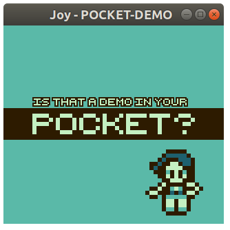

# Joy

Just another Gameboy (Color) emulator, in Rust. The cpu is cycle accurate, passed blargg's cpu_instrs and instr_timing tests, but not others. Apu and ppu have been implemented. 

## Run

```sh
cargo run --release rom_file -s scale
```

## key Mappings

| `Input` | <kbd>Z</kbd> | <kbd>X</kbd> | <kbd>C</kbd> | <kbd>V</kbd> | <kbd>↑</kbd> | <kbd>↓</kbd> | <kbd>←</kbd> | <kbd>→</kbd> | <kbd>Shift</kbd> | <kbd>S</kbd> |
| :---: | :---: | :---: | :---: | :---: | :---: | :---: | :---: | :---: | :---: | :---: |
| **`key`** | A | B | Start | Select | Up | Down | Left | Right | Pause | Save |

## Screenshots




## References:

* [op codes](https://pastraiser.com/cpu/gameboy/gameboy_opcodes.html)
* [gbdev](https://gbdev.gg8.se/wiki/articles/Main_Page)
* [Pan Docs](http://problemkaputt.de/pandocs.htm)
* [codeslinger](http://www.codeslinger.co.uk/pages/projects/gameboy/beginning.html)
* [imrannazar's emulation in js](http://imrannazar.com/GameBoy-Emulation-in-JavaScript:-The-CPU)
* others in comments
